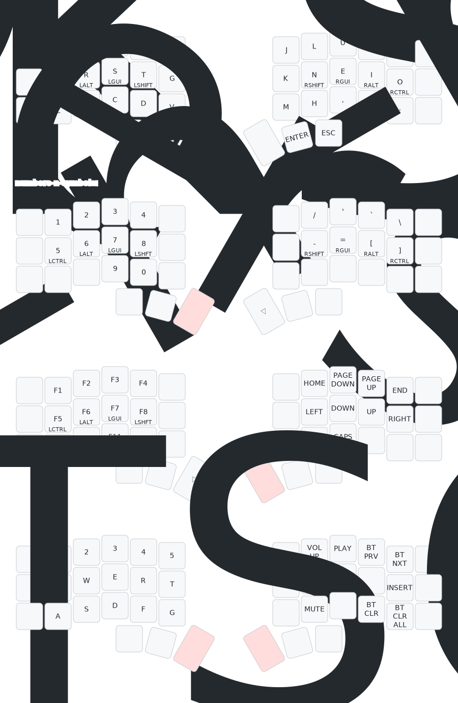

# zmk-config-chocofi

The configuration on this repository is edited using: [keymap-editor](https://nickcoutsos.github.io/keymap-editor/); and the image layout is drawn using [keymap-drawer](https://keymap-drawer.streamlit.app/) (automatically draws it using GitHub actions).

- Keyboard: [pashutk/chocofi](https://github.com/pashutk/chocofi) 
    - Controller SuperMini NRF52840 firmware: [zmk](https://zmk.dev) 
    - Display: OLED
    - Other parts:
        - Kit: [kirscables chocofi](https://kriscables.com/chocofi/) 
        - Switches and keycaps: [splitkb](https://splitkb.com/collections/switches-and-keycaps) 

## Layout

