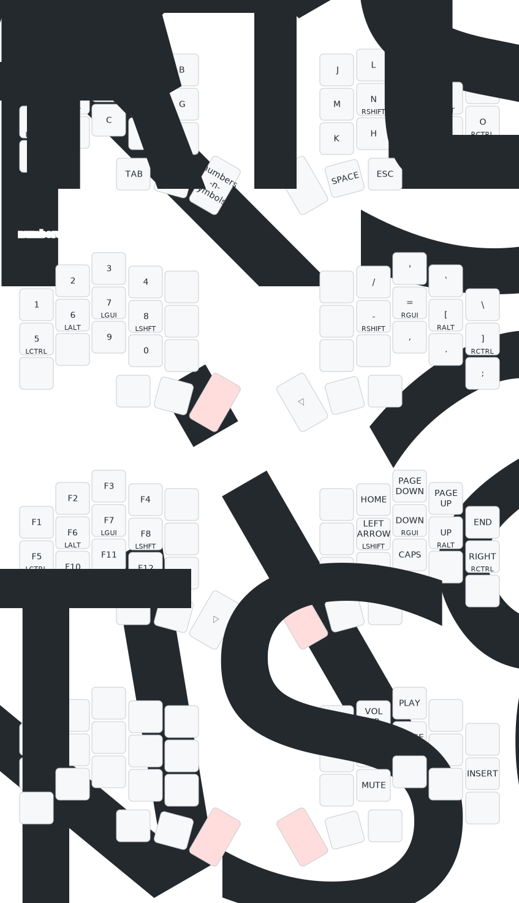

# zmk-config-chocofi

Keyboard: [pashutk/chocofi](https://github.com/pashutk/chocofi) 

The configuration on this repository is edited using: [keymap-editor](https://nickcoutsos.github.io/keymap-editor/), and the image layout is drawn using [keymap-drawer](https://keymap-drawer.streamlit.app/) (automatically draws it using GitHub actions).

## Layout

## Bill of materials

- DIY kit
  - [link](https://kriscables.com/chocofi/)
  - Controller: ProMicro NRF52840
  - The following items I don't use: base plate, TRRS adapter and display
- Power switch 
  -Added a power switch using the same approach described on the bellow links:
    - [Power switch on TRRS holes](https://www.reddit.com/r/ErgoMechKeyboards/comments/13rb3tk/updates_to_the_chocofi/)
    - [First ergo mech keeb, Chocofi, a couple questions](https://www.reddit.com/r/ErgoMechKeyboards/comments/1j65pe7/first_ergo_mech_keeb_chocofi_a_couple_questions/)
    - [Wireless Chocofi Build Questions](https://www.reddit.com/r/ErgoMechKeyboards/comments/10af6fl/wireless_chocofi_build_questions/)
    - [Any creative ideas for fitting an on/off switch into a Corne Light PCB?](https://www.reddit.com/r/ErgoMechKeyboards/comments/v8m1vc/any_creative_ideas_for_fitting_an_onoff_switch/?utm_source=share&utm_medium=web3x&utm_name=web3xcss&utm_term=1&utm_content=share_button)
- Switches and keycaps are from: [splitkb](https://splitkb.com/collections/switches-and-keycaps) 
- 800 mAh battery
- [Massive chocofi case](https://www.printables.com/model/814712-massive-chocofi-case)
- [M2 threaded inserts](https://www.amazon.es/dp/B0CS6XJSSL?ref=ppx_yo2ov_dt_b_fed_asin_title&th=1)
- [Seeed Studio XIAO nRF52840](https://www.seeedstudio.com/Seeed-XIAO-BLE-nRF52840-p-5201.html)
- [Seeed Xiao BLE Case](https://www.printables.com/model/522586-seeed-xiao-ble-case)

## Picture

